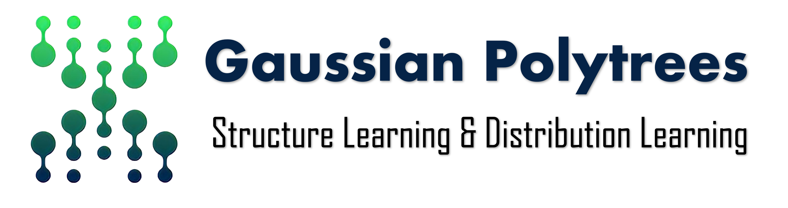

 &nbsp; &nbsp;

                                                               
# Optimal Estimation of Gaussian (Poly)trees

 This is an implementation of the following paper:
 "[Optimal Estimation of Gaussian (Poly)trees]()" arXiv preprint arXiv (2023).

## Performance comparison
SHD        | PRR
:--------------------------------------------------------------------:|:-----------------------------------------------------------------------------------:
  |  
